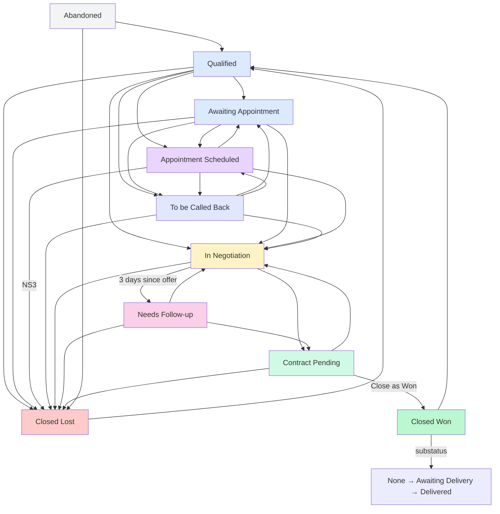
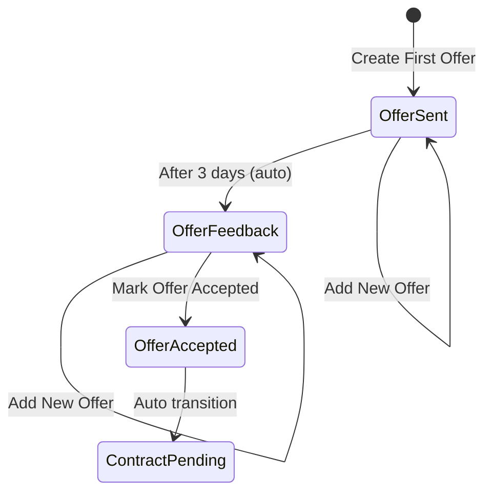

# Opportunity State Machine

## Flow Diagram



## Stage Summary

| Stage | Color | Entry Trigger | Primary Action | Key Widget |
|-------|-------|---------------|----------------|------------|
| **Qualified** | Blue | Lead converted | Schedule Appointment | OOFB (7-13d), UFB (14+d) |
| **Awaiting Appointment** | Blue | Qualified, no appointment | Schedule Appointment | OOFB (7-13d), UFB (14+d) |
| **Appointment Scheduled** | Purple | Appointment set | View/Reschedule Apt | NS (no-show tracking) |
| **To be Called Back** | Indigo | Callback set | Call Prospect | - |
| **In Negotiation** | Yellow | First offer created | Follow Up / Request Feedback | OFB (5+d), NFU (5+d in Feedback only) |
| **Needs Follow-up** | Pink | Offer pending (3+d) | Request Decision | OFB, NFU |
| **Contract Pending** | Emerald | Contract date set | Finalize Contract | CFB (7+d) |
| **Closed Won** | Green | Contract signed | Schedule Delivery* | CFB, DFB |
| **Closed Lost** | Red | Manually closed / NS3 | None | - |
| **Abandoned** | Gray | Inactive 30+ days | Reopen | ABANDONED |

\* Dynamic: Schedule Delivery → Confirm Delivery → Collect Feedback (based on substatus)

## Closed Won Substatus

```
Closed Won
    ├─ None                  → "Schedule Delivery"
    ├─ Awaiting Delivery     → "Confirm Delivery"
    └─ Delivered             → "Collect Feedback"
```

## In Negotiation Substatus Flow

The "In Negotiation" stage has three substatus values that track the offer lifecycle:



### Substatus Definitions

| Substatus | Display | Trigger | Available Actions |
|-----------|---------|---------|-------------------|
| **Offer Sent** | In Negotiation - Offer Sent | First offer created OR showed up for appointment | Follow Up, Add Offer, Mark Accepted, Communicate |
| **Offer Feedback** | In Negotiation - Offer Feedback | 3 days after most recent offer | Follow Up, Add Offer, Mark Accepted, Communicate, Schedule Apt, Close Lost |
| **Offer Accepted** | Offer Accepted | Any offer marked as accepted | Auto-transitions to Contract Pending |

### Substatus Transition Rules

1. **Offer Creation**: When first offer is created → stage becomes "In Negotiation", substatus = "Offer Sent"
2. **Auto-Transition**: After 3 days with no acceptance → substatus changes to "Offer Feedback"
3. **Add New Offer**: Can happen at any time, does NOT reset the 3-day timer or substatus
4. **Offer Acceptance**: Mark any offer as accepted → substatus = "Offer Accepted" → auto-transition to "Contract Pending" stage
5. **Multiple Offers**: All offers tracked in `offers` array, displayed in carousel

## No-Show (NS) Flow

```
NS1 (1st miss) → To be Called Back (2 days)
NS2 (2nd miss) → To be Called Back (2 days)  
NS3 (3rd miss) → Closed Lost (automatic)
```

## Critical Business Rules

### 1. Contract Path Enforcement
- **"Close as Won"** only available from **Contract Pending**
- Path: `Needs Follow-up → Add Contract → Contract Pending → Close as Won`

### 2. Auto-Transitions
- First offer created: `Qualified/Awaiting Appointment/Appointment Scheduled → In Negotiation (Offer Sent)`
- Appointment scheduled: `Awaiting Appointment → Appointment Scheduled`
- Offer 3 days old: `In Negotiation (Offer Sent) → In Negotiation (Offer Feedback)`
- Offer accepted: `In Negotiation (Offer Accepted) → Contract Pending`
- Third no-show: `Appointment Scheduled → Closed Lost`
- Delivery date set: Substatus `None → Awaiting Delivery`
- Delivery logged: Substatus `Awaiting Delivery → Delivered`

### 3. Stage Access Control
| Action | Available From |
|--------|---------------|
| Close as Won | Contract Pending only |
| Reopen | Closed Won, Closed Lost only |
| Select Vehicle | All active stages |
| Close as Lost | All stages except Closed Won/Lost |

## Task Widgets Reference

| Widget | Trigger | Purpose |
|--------|---------|---------|
| **OOFB** | Qualified 7-13 days, no offers | Opportunity Offer Follow-up |
| **UFB** | Qualified 14+ days, no offers | Urgent Follow-up |
| **NS** | Appointment past, not completed | No-Show tracking (NS1/NS2/NS3) |
| **OFB** | Negotiation 5+ days, no contract | Offer Follow-up |
| **NFU** | Negotiation (Offer Feedback) 5+ days, no future apt | No Future Appointment (Schedule or Close) |
| **CFB** | Contract 7+ days, no delivery | Contract Follow-up |
| **DFB** | Delivery date set | Delivery Follow-up |
| **ABANDONED** | Opportunity inactive 30+ days | Abandonment warning |

## Implementation Files

```
Core Logic:
  ├─ src/composables/useOpportunityStateMachine.js (config)
  ├─ src/utils/stageMapper.js (stage calculation)
  └─ src/utils/opportunityRules.js (business rules)

UI:
  ├─ src/components/opportunities/OpportunityManagementWidget.vue
  ├─ src/components/shared/StageOwnerBar.vue (stage badges)
  └─ src/components/opportunities/tasks/*.vue (task widgets)
```

## Database Schema

```javascript
{
  stage: String,                    // 'Qualified', 'In Negotiation', 'Closed Won', 'Closed Lost'
  displayStage: String,             // Computed from stage + context (9 stages)
  negotiationSubstatus: String,     // null | 'Offer Sent' | 'Offer Feedback' | 'Offer Accepted'
  deliverySubstatus: String,        // null | 'Awaiting Delivery' | 'Delivered'
  contractDate: String,             // ISO date
  deliveryDate: String,             // ISO date
  callbackDate: String,             // ISO date
  scheduledAppointment: Object,
  noShowCount: Number,              // 0-3 (in calendar events)
  offers: Array[{                   // Array of offer objects
    id: String,
    createdAt: String,              // ISO date
    vehicleBrand: String,
    vehicleModel: String,
    vehicleYear: Number,
    price: Number,
    status: String,                 // 'active' | 'accepted' | 'archived'
    data: Object                    // Full offer details from OfferWidget
  }]
}
```

## Actionable Questions (Home Dashboard)

Generated for high-priority follow-ups:

- **appointment-followup**: Did appointment happen? (Yes/No)
- **ns-followup**: Reschedule after no-show? (Yes/No/Reassign)
- **offer-followup**: Follow up on pending offer (View)
- **stuck-opportunity**: Opportunity stuck in stage? (Yes/No/Reassign)
- **lead-qualification-urgency**: Qualify urgent lead? (Yes/No/Reassign)

Priority levels: CRITICAL (1), HIGH (2-3), MEDIUM (4+)

---

**Total Stages**: 10 (9 main + Abandoned)  
**Substatus Tracking**: Closed Won only  
**Badge Indicators**: In Negotiation only  
**Auto-Close Trigger**: NS3 (third no-show)

## Stage Distinctions

### Awaiting Appointment vs Appointment Scheduled

- **Awaiting Appointment**: Qualified opportunity with NO appointment scheduled. Primary action is to schedule an appointment. Shows OOFB/UFB widgets if no offers after 7+ days.

- **Appointment Scheduled**: Qualified opportunity WITH an appointment scheduled. Primary action is to view/reschedule the appointment. Shows NS (No-Show) widget if appointment is missed.
